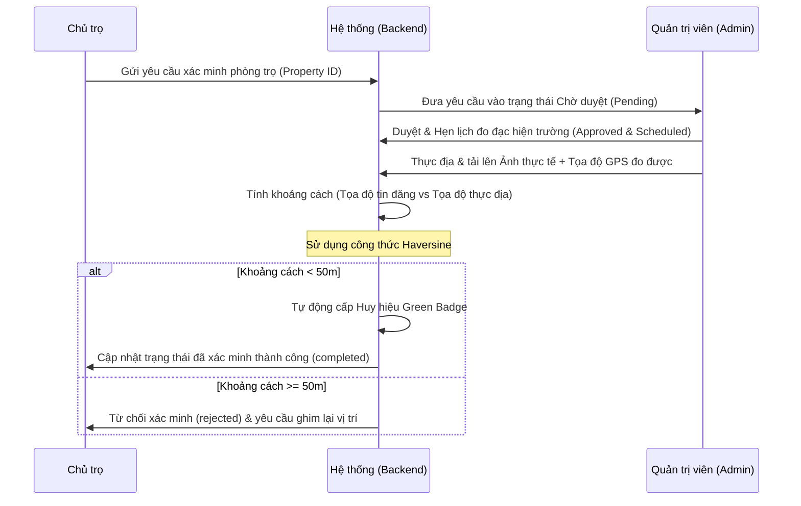

# 🏠 MapHome Backend API — Developer & Architecture Guide

Tài liệu hướng dẫn phát triển và cấu trúc hệ thống backend dành cho lập trình viên (Developer). Hệ thống được xây dựng trên nền tảng **Node.js, Express, và MongoDB (Mongoose)**.

> 🔗 **API Deploy:** [https://exe101project-maphome-api.up.railway.app](https://exe101project-maphome-api.up.railway.app)
> 📖 **Swagger Docs:** [https://exe101project-maphome-api.up.railway.app/api-docs](https://exe101project-maphome-api.up.railway.app/api-docs)

---

## 📊 TIẾN ĐỘ BACKEND (Backend Progress)

> Cập nhật lần cuối: **23/06/2026**

### ✅ Đã hoàn thành

#### 🗄️ Models (18 schemas)
| Model | Mô tả |
|:------|:------|
| `User.js` | Tài khoản người dùng, mật khẩu bcrypt, vai trò, danh sách yêu thích |
| `Property.js` | Phòng trọ với GeoJSON Point, ảnh Cloudinary, tiện ích, trạng thái duyệt |
| `Booking.js` | Lịch hẹn xem phòng (pending/confirmed/cancelled/completed) |
| `VerificationRequest.js` | Yêu cầu xác minh thực địa, ảnh GPS, kết quả Haversine |
| `Landlord.js` | Hồ sơ chủ nhà, đánh giá sao, tỷ lệ phản hồi |
| `Broker.js` | Hồ sơ môi giới phòng trọ |
| `Voucher.js` | Mã giảm giá đăng tin, phần trăm, ngày hết hạn |
| `Subscription.js` | Gói đăng tin đang hoạt động của chủ nhà |
| `SubscriptionPlan.js` | Danh sách gói dịch vụ (Basic, VIP, Premium) |
| `Transaction.js` | Lịch sử giao dịch thanh toán VNPay/PayOS |
| `Blog.js` | Bài viết tin tức cẩm nang thuê trọ |
| `Notification.js` | Thông báo hệ thống trong app |
| `Review.js` | Đánh giá phòng trọ của khách thuê |
| `Report.js` | Báo cáo vi phạm tin đăng |
| `Lead.js` | Khách hàng tiềm năng cho broker |
| `Location.js` | Dữ liệu địa điểm (trường học, bệnh viện...) |
| `Contact.js` | Tin nhắn liên hệ từ form website |
| `SystemSetting.js` | Cấu hình hệ thống (bảo trì, thông số...) |

#### 🛣️ API Routes (23 nhóm endpoints)
| Route file | Chức năng |
|:-----------|:----------|
| `authRoutes.js` | Đăng ký, đăng nhập, Google OAuth, refresh token, đổi mật khẩu |
| `propertyRoutes.js` | CRUD phòng trọ, tìm kiếm nâng cao, tìm theo GPS (`$nearSphere`) |
| `bookingRoutes.js` | Đặt lịch hẹn, duyệt/từ chối, xem lịch |
| `verificationRoutes.js` | Gửi yêu cầu xác minh, tải ảnh GPS, tính khoảng cách Haversine |
| `adminRoutes.js` | Thống kê tổng quan, quản lý người dùng, duyệt xác minh |
| `landlordDashboardRoutes.js` | Dashboard chủ nhà: phòng, lịch hẹn, doanh thu |
| `brokerDashboardRoutes.js` | Dashboard broker: leads, phòng trọ |
| `paymentRoutes.js` | Tạo link VNPay, PayOS, xử lý callback |
| `voucherRoutes.js` | CRUD voucher, áp dụng mã giảm giá, lưu voucher |
| `subscriptionRoutes.js` | Quản lý gói đăng tin |
| `blogRoutes.js` | CRUD bài viết Blog |
| `reviewRoutes.js` | Đánh giá phòng trọ, lấy reviews mới nhất |
| `notificationRoutes.js` | Lấy thông báo, đánh dấu đã đọc |
| `uploadRoutes.js` | Upload ảnh đơn/nhiều ảnh lên Cloudinary |
| `ai.routes.js` | Chatbot Groq LLM |
| `userRoutes.js` | Cập nhật hồ sơ, đổi avatar |
| `reportRoutes.js` | Báo cáo vi phạm |
| `contactRoutes.js` | Form liên hệ |
| `mapRoutes.js` | Tích hợp Goong Maps (địa điểm lân cận) |
| `locationRoutes.js` | Dữ liệu địa điểm tham chiếu |
| `landlordRoutes.js` | Hồ sơ chủ nhà công khai |
| `transactionRoutes.js` | Lịch sử giao dịch |
| `settingRoutes.js` | Cấu hình hệ thống |

#### 🔑 Bảo mật & Middleware
- [x] JWT Access Token (ngắn hạn) + Refresh Token (30 ngày)
- [x] Middleware phân quyền theo role (`user`, `landlord`, `broker`, `admin`)
- [x] Multer upload ảnh (giới hạn dung lượng, lọc mime-type)
- [x] Validation input (express-validator)
- [x] CORS cấu hình cho Vercel + localhost

#### 🌐 Tích hợp bên ngoài
- [x] **MongoDB Atlas** với Geospatial Index `2dsphere`
- [x] **Cloudinary** lưu trữ ảnh đám mây
- [x] **Nodemailer** SMTP Gmail gửi mail khôi phục mật khẩu
- [x] **Groq SDK** (LLaMA model) cho AI Chatbot
- [x] **VNPay Sandbox** thanh toán nội địa
- [x] **PayOS** thanh toán QR Code
- [x] **Goong Maps API** tìm địa điểm xung quanh

#### 🚀 Deploy & Vận hành
- [x] Deploy tự động lên **Railway** từ GitHub
- [x] Swagger UI tại `/api-docs`
- [x] Biến môi trường phân tách Local/Deploy (`USE_LOCAL_BACKEND`)
- [x] API stats công khai `/api/properties/stats/public` cung cấp dữ liệu thực cho trang chủ

---

## 🛠️ Technology Stack & Quy Chuẩn Code
- **Runtime:** Node.js (v18+)
- **Framework:** Express.js
- **Database:** MongoDB Atlas (Mongoose ORM)
- **Authentication:** Stateless JWT (Access Token & Refresh Token)
- **Image Upload:** Multer (xử lý file đệm) kết hợp lưu trữ Cloudinary
- **API Documentation:** Swagger UI (OpenAPI v3)
- **Email Service:** Nodemailer (SMTP Gmail)
- **AI Engine:** Groq SDK (LLM Chatbot)

---

## 📂 Sơ Đồ Cấu Trúc Thư Mục (Directory Tree)

```text
MapHome_backend_NodeJS/
├── src/
│   ├── config/             # Cấu hình kết nối DB, Cloudinary, PayOS, VNPay
│   ├── controllers/        # Xử lý logic nghiệp vụ chính (Business Logic)
│   ├── middleware/         # Khóa bảo mật (Auth, Role, Upload Multer)
│   ├── models/             # Schema định nghĩa cấu trúc bảng dữ liệu (Mongoose)
│   ├── routes/             # Khai báo các endpoints định tuyến API
│   ├── utils/              # Các hàm bổ trợ (Gửi mail, tính khoảng cách, định dạng)
│   └── index.js            # Entrypoint của toàn bộ ứng dụng Express
├── API_DOCUMENTATION.md    # Tài liệu API dạng văn bản
├── TESTING_GUIDE.md        # Hướng dẫn kiểm thử thủ công và truy vấn Compass
└── package.json            # Quản lý dependencies & scripts chạy dự án
```

---

## 💼 Chi Tiết Các Nghiệp Vụ Cốt Lõi (Detailed Business Workflows)

### 🔑 1. Luồng Đăng Ký, Đăng Nhập & Quản Lý Phiên (Auth Lifecycle)
- **Bước 1 (Đăng ký):** Người dùng gửi form gồm username, email, password, fullName, phone, role (`user`/`landlord`). Mật khẩu được băm một chiều bằng `bcryptjs` với độ muối 10 trước khi lưu vào MongoDB.
- **Bước 2 (Đăng nhập):** Khách hàng đăng nhập bằng Username hoặc Email. Hệ thống kiểm tra xem tài khoản tồn tại và mật khẩu khớp hay không.
- **Bước 3 (Cấp token):** Hệ thống tạo ra một cặp khóa:
  - `accessToken`: Chứa thông tin userId, role và thời gian hết hạn ngắn (15-30 phút), ký bằng mã bảo mật `JWT_SECRET`. Token này được đính kèm vào Header của mọi request kế tiếp dưới dạng `Authorization: Bearer <token>`.
  - `refreshToken`: Thời hạn dài (30 ngày), ký bằng `REFRESH_TOKEN_SECRET`.
- **Bước 4 (Khôi phục mật khẩu):** Người dùng nhập email. Backend sinh mật khẩu tạm thời ngẫu nhiên, lưu mật khẩu tạm thời đã mã hóa vào tài khoản của người dùng, rồi dùng thư viện `nodemailer` gửi mail thông báo mật khẩu mới cho người dùng thông qua SMTP Gmail.

### 📍 2. Luồng Lưu Trữ & Tìm Kiếm Theo Vị Trí Bản Đồ (Geospatial Property Search)
- **Bước 1 (Đăng tin):** Chủ nhà chọn vị trí trên giao diện bản đồ. Tọa độ được gửi về dưới dạng cặp số `[Kinh độ (Longitude), Vĩ độ (Latitude)]`.
- **Bước 2 (Lưu trữ Mongoose):** Dữ liệu vị trí được lưu trữ theo cấu trúc GeoJSON chuẩn trong database:
  ```json
  "location": {
    "type": "Point",
    "coordinates": [longitude, latitude]
  }
  ```
  MongoDB Atlas yêu cầu tạo chỉ mục `2dsphere` trên trường `location` để thực thi nhanh các toán tử tính toán địa lý.
- **Bước 3 (Tìm kiếm theo bán kính):** Khi người dùng gọi API `/api/properties/nearby?lat=10.77&lng=106.69&radiusKm=3`, backend thực hiện câu lệnh truy vấn MongoDB bằng cách sử dụng toán tử `$nearSphere` và `$maxDistance` (quy đổi bán kính từ Km sang Mét):
  ```javascript
  Property.find({
    location: {
      $nearSphere: {
        $geometry: { type: "Point", coordinates: [lng, lat] },
        $maxDistance: radiusInMeters
      }
    }
  })
  ```
- **Bước 4 (Tìm địa điểm xung quanh):** Backend tích hợp gọi API Goong Maps để tìm kiếm các bệnh viện, trường đại học trong bán kính và trả về danh sách kèm khoảng cách đo đạc chính xác.

### 📅 3. Luồng Đặt Lịch Hẹn Xem Phòng Trọ (Room Viewing Booking)
- **Bước 1 (Người thuê đặt hẹn):** Khách thuê gửi yêu cầu đặt hẹn gồm: `propertyId`, `bookingDate` (ngày xem), `bookingTime` (giờ xem), `customerName`, `customerPhone` và `note`.
- **Bước 2 (Lưu & Thông báo):** Hệ thống tự động điền `userId` từ token và tìm ra `landlordId` của chủ căn nhà đó. Bản ghi lịch hẹn được tạo với trạng thái ban đầu là `pending` (Chờ duyệt). Một thông báo (`Notification`) được bắn tự động đến tài khoản của chủ trọ.
- **Bước 3 (Chủ trọ phản hồi):** Chủ trọ xem danh sách lịch hẹn trên Dashboard hoặc trên giao diện Lịch (Calendar). Chủ nhà có thể:
  - Chọn **Đồng ý (Approve):** Đổi trạng thái lịch hẹn thành `confirmed`.
  - Chọn **Từ chối (Reject/Cancel):** Đổi trạng thái thành `cancelled`.
- **Bước 4 (Hoàn thành):** Sau khi cuộc gặp diễn ra thành công, trạng thái sẽ được cập nhật thành `completed`.

### 🛡️ 4. Luồng Xác Thực Thực Địa & Cấp Tích Xanh (Inspection & Green Badge)


### 💳 5. Luồng Áp Dụng Mã Giảm Giá & Thanh Toán (Pricing, Voucher & VNPay/PayOS)
- **Bước 1 (Tạo hóa đơn):** Chủ nhà chọn gói tin cần mua. Backend nhận yêu cầu gồm `packageId` và `voucherCode` (nếu có).
- **Bước 2 (Áp dụng giảm giá):** Hệ thống tìm kiếm voucher trong DB, kiểm tra xem còn hạn dùng và trạng thái kích hoạt hay không. Nếu hợp lệ, trừ phần trăm giảm giá để tính ra số tiền cuối cùng cần thanh toán (`amount`).
- **Bước 3 (Khởi tạo link thanh toán):** Backend gọi API của VNPay/PayOS truyền mã đơn hàng, số tiền và `returnUrl` (đường dẫn xử lý kết quả). Cổng thanh toán trả về một liên kết URL. Backend lưu giao dịch ở trạng thái `pending` và gửi URL này về cho client.
- **Bước 4 (Xác nhận kết quả):** Khi người dùng hoàn tất thanh toán, trình duyệt chuyển hướng về đường dẫn callback của backend. Backend tiến hành:
  - Xác thực chữ ký số bảo mật của giao dịch (checksum hash) gửi từ cổng để tránh giả mạo số tiền.
  - Cập nhật trạng thái giao dịch `Transaction` thành `success`.
  - Gia hạn số ngày đăng tin nổi bật trong bảng `Subscription` tương ứng của chủ nhà.
  - Chuyển hướng người dùng về trang giao diện thông báo thành công hoặc thất bại.

---

## ⚡ API Endpoint Cheat-sheet (Dành cho Tích hợp Frontend)

| Chức năng | Endpoint | Phương thức | Cần Auth | Ghi chú |
| :--- | :--- | :---: | :---: | :--- |
| **Auth** | `/api/auth/register` | `POST` | Không | Đăng ký tài khoản mới |
| **Auth** | `/api/auth/login` | `POST` | Không | Trả về User info & Token |
| **Auth** | `/api/auth/refresh` | `GET` | Không | Làm mới Access Token |
| **Phòng trọ** | `/api/properties` | `GET` | Không | Lấy toàn bộ danh sách phòng |
| **Phòng trọ** | `/api/properties/search` | `GET` | Không | Tìm nâng cao (phân trang, giá, diện tích) |
| **Phòng trọ** | `/api/properties/nearby` | `GET` | Không | Tìm theo GPS (`lat`, `lng`, `radiusKm`) |
| **Phòng trọ** | `/api/properties/stats/public` | `GET` | Không | Số liệu thống kê trang chủ |
| **Phòng trọ** | `/api/properties` | `POST` | **Landlord** | Đăng phòng mới |
| **Đặt lịch** | `/api/bookings` | `POST` | **User** | Đặt lịch hẹn xem phòng |
| **Xác minh** | `/api/verifications` | `POST` | **Landlord** | Gửi yêu cầu hẹn lịch kiểm tra |
| **Voucher** | `/api/vouchers/promoted` | `GET` | Không | Danh sách voucher quảng bá |
| **Blog** | `/api/blogs` | `GET` | Không | Danh sách bài viết |
| **Admin** | `/api/admin/stats` | `GET` | **Admin** | Lấy dữ liệu thống kê tổng quan |
| **Admin** | `/api/admin/verification/:id/complete` | `PUT` | **Admin** | Hoàn thành và tự động cấp Badge |

---

## ⚙️ Hướng Dẫn Setup Dự Án Cực Nhanh (Quick Start)

### 1. Cài đặt môi trường
Copy file `.env.example` thành `.env` và điền cấu hình database MongoDB Atlas cá nhân hoặc dùng chung, cấu hình SMTP Gmail cá nhân (cần mật khẩu ứng dụng 16 chữ số) và các thông số Cloudinary.

### 2. Thiết lập Chỉ Mục Không Gian (Geospatial Index)
**Bắt buộc** để tính năng tìm kiếm bản đồ xung quanh hoạt động:
Mở MongoDB Compass, kết nối cơ sở dữ liệu, tìm tới collection `properties`, mở tab **Indexes** và tạo chỉ mục sau:
- **Index Field:** `location`
- **Type:** `2dsphere`

Hoặc chạy lệnh này trực tiếp trong Mongo Shell (`mongosh`):
```javascript
use MapHome
db.properties.createIndex({ "location": "2dsphere" })
```

### 3. Chạy Server
```bash
# Cài đặt thư viện
npm install

# Chạy DEV (tự khởi động lại khi sửa file)
npm run dev

# Chạy PRODUCTION
npm start
```
*Tài liệu API tương tác trực tiếp chạy tại địa chỉ: `http://localhost:5000/api-docs`*

### 4. Cấu hình chuyển đổi chạy Local hoặc Deploy
Thay đổi biến môi trường trong tệp `.env`:
- **Chạy Local (`USE_LOCAL_BACKEND=true`)**: Server sẽ tự động ghi đè địa chỉ URL trỏ về `localhost`.
- **Chạy Deploy (`USE_LOCAL_BACKEND=false`)**: Server chạy chế độ mặc định, sử dụng link deploy chính thức của Railway.
