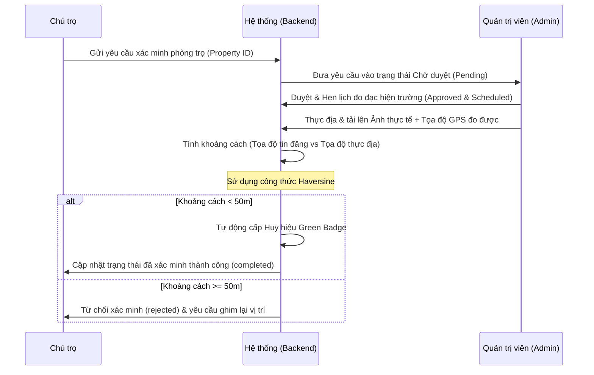

# 🏠 MapHome Backend API — Developer & Architecture Guide

Tài liệu hướng dẫn phát triển và cấu trúc hệ thống backend dành cho lập trình viên (Developer). Hệ thống được xây dựng trên nền tảng **Node.js, Express, và MongoDB (Mongoose)**.

---

## 🛠️ Technology Stack & Quy Chuẩn Code
- **Runtime:** Node.js (v18+)
- **Framework:** Express.js
- **Database:** MongoDB Atlas (Mongoose ORM)
- **Authentication:** Stateless JWT (Access Token & Refresh Token)
- **Image Upload:** Multer (xử lý file đệm) kết hợp lưu trữ Cloudinary/Local Disk
- **API Documentation:** Swagger UI (OpenAPI v3)
- **Email Service:** Nodemailer (SMTP Gmail)
- **AI Engine:** Groq SDK (LLM Chatbot)

---

## 📂 Sơ Đồ Cấu Trúc Thư Mục (Directory Tree)

```text
MapHome_backend_NodeJS/
├── src/
│   ├── config/             # Cấu hình kết nối DB, Cloudinary, PayOS, VNPay
│   ├── controllers/        # Xử lý logic nghiệp vụ chính (Business Logic)
│   ├── middleware/         # Khóa bảo mật (Auth, Role, Upload Multer)
│   ├── models/             # Schema định nghĩa cấu trúc bảng dữ liệu (Mongoose)
│   ├── routes/             # Khai báo các endpoints định tuyến API
│   ├── utils/              # Các hàm bổ trợ (Gửi mail, tính khoảng cách, định dạng)
│   └── index.js            # Entrypoint của toàn bộ ứng dụng Express
├── API_DOCUMENTATION.md    # Tài liệu API dạng văn bản
├── TESTING_GUIDE.md        # Hướng dẫn kiểm thử thủ công và truy vấn Compass
└── package.json            # Quản lý dependencies & scripts chạy dự án
```

---

## 💼 Chi Tiết Các Nghiệp Vụ Cốt Lõi (Detailed Business Workflows)

Dưới đây là mô tả chi tiết quy trình xử lý (logic nghiệp vụ) của các chức năng cốt lõi trong hệ thống backend:

### 🔑 1. Luồng Đăng Ký, Đăng Nhập & Quản Lý Phiên (Auth Lifecycle)
- **Bước 1 (Đăng ký):** Người dùng gửi form gồm username, email, password, fullName, phone, role (`user`/`landlord`). Mật khẩu được băm một chiều bằng `bcryptjs` với độ muối 10 trước khi lưu vào MongoDB.
- **Bước 2 (Đăng nhập):** Khách hàng đăng nhập bằng Username hoặc Email. Hệ thống kiểm tra xem tài khoản tồn tại và mật khẩu khớp hay không.
- **Bước 3 (Cấp token):** Hệ thống tạo ra một cặp khóa:
  - `accessToken`: Chứa thông tin userId, role và thời gian hết hạn ngắn (15-30 phút), ký bằng mã bảo mật `JWT_SECRET`. Token này được đính kèm vào Header của mọi request kế tiếp dưới dạng `Authorization: Bearer <token>`.
  - `refreshToken`: Thời hạn dài (30 ngày), ký bằng `REFRESH_TOKEN_SECRET`.
- **Bước 4 (Khôi phục mật khẩu):** Người dùng nhập email. Backend sinh mật khẩu tạm thời ngẫu nhiên, lưu mật khẩu tạm thời đã mã hóa vào tài khoản của người dùng, rồi dùng thư viện `nodemailer` gửi mail thông báo mật khẩu mới cho người dùng thông qua SMTP Gmail.

### 📍 2. Luồng Lưu Trữ & Tìm Kiếm Theo Vị Trí Bản Đồ (Geospatial Property Search)
- **Bước 1 (Đăng tin):** Chủ nhà chọn vị trí trên giao diện bản đồ. Tọa độ được gửi về dưới dạng cặp số `[Kinh độ (Longitude), Vĩ độ (Latitude)]`.
- **Bước 2 (Lưu trữ Mongoose):** Dữ liệu vị trí được lưu trữ theo cấu trúc GeoJSON chuẩn trong database:
  ```json
  "location": {
    "type": "Point",
    "coordinates": [longitude, latitude]
  }
  ```
  MongoDB Atlas yêu cầu tạo chỉ mục `2dsphere` trên trường `location` để thực thi nhanh các toán tử tính toán địa lý.
- **Bước 3 (Tìm kiếm theo bán kính):** Khi người dùng gọi API `/api/properties/nearby?lat=10.77&lng=106.69&radiusKm=3`, backend thực hiện câu lệnh truy vấn MongoDB bằng cách sử dụng toán tử `$nearSphere` và `$maxDistance` (quy đổi bán kính từ Km sang Mét):
  ```javascript
  Property.find({
    location: {
      $nearSphere: {
        $geometry: { type: "Point", coordinates: [lng, lat] },
        $maxDistance: radiusInMeters
      }
    }
  })
  ```
- **Bước 4 (Tìm địa điểm xung quanh):** Backend tích hợp gọi API Goong Maps để tìm kiếm các bệnh viện, trường đại học trong bán kính và trả về danh sách kèm khoảng cách đo đạc chính xác.

### 📅 3. Luồng Đặt Lịch Hẹn Xem Phòng Trọ (Room Viewing Booking)
- **Bước 1 (Người thuê đặt hẹn):** Khách thuê gửi yêu cầu đặt hẹn gồm: `propertyId`, `bookingDate` (ngày xem), `bookingTime` (giờ xem), `customerName`, `customerPhone` và `note`.
- **Bước 2 (Lưu & Thông báo):** Hệ thống tự động điền `userId` từ token và tìm ra `landlordId` của chủ căn nhà đó. Bản ghi lịch hẹn được tạo với trạng thái ban đầu là `pending` (Chờ duyệt). Một thông báo (`Notification`) được bắn tự động đến tài khoản của chủ trọ.
- **Bước 3 (Chủ trọ phản hồi):** Chủ trọ xem danh sách lịch hẹn trên Dashboard hoặc trên giao diện Lịch (Calendar). Chủ nhà có thể:
  - Chọn **Đồng ý (Approve):** Đổi trạng thái lịch hẹn thành `confirmed`.
  - Chọn **Từ chối (Reject/Cancel):** Đổi trạng thái thành `cancelled`.
- **Bước 4 (Hoàn thành):** Sau khi cuộc gặp diễn ra thành công, trạng thái sẽ được cập nhật thành `completed`.

### 🛡️ 4. Luồng Xác Thực Thực Địa & Cấp Tích Xanh (Inspection & Green Badge)

- **Hàm tính khoảng cách Haversine:** Chuyển đổi tọa độ GPS (Vĩ độ/Kinh độ) của hai điểm thành Radian để tính khoảng cách đường chim bay chính xác trên mặt cầu Trái Đất. Tránh trường hợp chủ nhà ghim một nơi nhưng nhà thực tế ở nơi khác.

### 💳 5. Luồng Áp Dụng Mã Giảm Giá & Thanh Toán (Pricing, Voucher & VNPay/PayOS)
- **Bước 1 (Tạo hóa đơn):** Chủ nhà chọn gói tin cần mua. Backend nhận yêu cầu gồm `packageId` và `voucherCode` (nếu có).
- **Bước 2 (Áp dụng giảm giá):** Hệ thống tìm kiếm voucher trong DB, kiểm tra xem còn hạn dùng và trạng thái kích hoạt hay không. Nếu hợp lệ, trừ phần trăm giảm giá để tính ra số tiền cuối cùng cần thanh toán (`amount`).
- **Bước 3 (Khởi tạo link thanh toán):** Backend gọi API của VNPay/PayOS truyền mã đơn hàng, số tiền và `returnUrl` (đường dẫn xử lý kết quả). Cổng thanh toán trả về một liên kết URL. Backend lưu giao dịch ở trạng thái `pending` và gửi URL này về cho client.
- **Bước 4 (Xác nhận kết quả):** Khi người dùng hoàn tất thanh toán, trình duyệt chuyển hướng về đường dẫn callback của backend. Backend tiến hành:
  - Xác thực chữ ký số bảo mật của giao dịch (checksum hash) gửi từ cổng để tránh giả mạo số tiền.
  - Cập nhật trạng thái giao dịch `Transaction` thành `success`.
  - Gia hạn số ngày đăng tin nổi bật trong bảng `Subscription` tương ứng của chủ nhà.
  - Chuyển hướng người dùng về trang giao diện thông báo thành công hoặc thất bại.

---

## 📂 Chi Tiết Từng File Code Cốt Lõi (Codebase Details)

### 🗄️ 1. Thư mục Models (`src/models/`)
Quản lý các Schema dữ liệu MongoDB thông qua Mongoose:
* [User.js](file:///e:/EXE101_Projects/EXE101_Project/MapHome_backend_NodeJS/src/models/User.js): Lưu thông tin tài khoản, mật khẩu (được mã hóa), email, điện thoại, vai trò (`role`: user, landlord, admin), và danh sách phòng trọ yêu thích (`favorites`).
* [Property.js](file:///e:/EXE101_Projects/EXE101_Project/MapHome_backend_NodeJS/src/models/Property.js): Lưu thông tin phòng trọ, giá thuê, diện tích, tiện ích (`amenities`), danh sách ảnh, thông tin chủ trọ, số lượt xem, trạng thái duyệt, thời gian hết hạn tin, và cấu trúc vị trí GeoJSON `Point` để thực hiện các truy vấn không gian.
* [Booking.js](file:///e:/EXE101_Projects/EXE101_Project/MapHome_backend_NodeJS/src/models/Booking.js): Lưu lịch hẹn xem phòng của khách hàng với chủ nhà (ngày, giờ, trạng thái cuộc hẹn).
* [VerificationRequest.js](file:///e:/EXE101_Projects/EXE101_Project/MapHome_backend_NodeJS/src/models/VerificationRequest.js): Theo dõi các yêu cầu xác minh thực địa từ chủ nhà hoặc người thuê trọ, lưu ảnh thực địa, tọa độ GPS thực địa khi cán bộ đến đo đạc, và các ghi chú của thanh tra viên.
* [Landlord.js](file:///e:/EXE101_Projects/EXE101_Project/MapHome_backend_NodeJS/src/models/Landlord.js): Hồ sơ chi tiết của chủ nhà (đánh giá sao, tỷ lệ phản hồi, trạng thái xác minh danh tính).
* [Voucher.js](file:///e:/EXE101_Projects/EXE101_Project/MapHome_backend_NodeJS/src/models/Voucher.js): Lưu thông tin các mã giảm giá cho dịch vụ đăng tin (phần trăm giảm giá, ngày hết hạn, trạng thái kích hoạt).
* [Subscription.js](file:///e:/EXE101_Projects/EXE101_Project/MapHome_backend_NodeJS/src/models/Subscription.js) & [SubscriptionPlan.js](file:///e:/EXE101_Projects/EXE101_Project/MapHome_backend_NodeJS/src/models/SubscriptionPlan.js): Lưu gói dịch vụ đăng tin nổi bật, thời hạn và phân loại gói (Ví dụ: Gói VIP tháng, năm).
* [Transaction.js](file:///e:/EXE101_Projects/EXE101_Project/MapHome_backend_NodeJS/src/models/Transaction.js): Ghi nhận lịch sử giao dịch thanh toán của chủ trọ.
* [Blog.js](file:///e:/EXE101_Projects/EXE101_Project/MapHome_backend_NodeJS/src/models/Blog.js): Quản lý các bài viết tin tức phòng trọ.
* [Notification.js](file:///e:/EXE101_Projects/EXE101_Project/MapHome_backend_NodeJS/src/models/Notification.js): Quản lý thông báo trong hệ thống.

### 🎮 2. Thư mục Controllers & Routes (`src/controllers/` & `src/routes/`)
Nơi xử lý logic nghiệp vụ và định tuyến API:
* **Xác thực:** [authController.js](file:///e:/EXE101_Projects/EXE101_Project/MapHome_backend_NodeJS/src/controllers/authController.js) & [authRoutes.js](file:///e:/EXE101_Projects/EXE101_Project/MapHome_backend_NodeJS/src/routes/authRoutes.js) thực hiện đăng ký, đăng nhập JWT, lấy thông tin cá nhân và gửi mail khôi phục mật khẩu.
* **Phòng trọ:** [propertyController.js](file:///e:/EXE101_Projects/EXE101_Project/MapHome_backend_NodeJS/src/controllers/propertyController.js) & [propertyRoutes.js](file:///e:/EXE101_Projects/EXE101_Project/MapHome_backend_NodeJS/src/routes/propertyRoutes.js) xử lý thêm/sửa/xóa phòng, tìm kiếm nâng cao, và truy vấn vị trí địa lý `$nearSphere` trong MongoDB Atlas.
* **Xác minh thực địa:** [verificationController.js](file:///e:/EXE101_Projects/EXE101_Project/MapHome_backend_NodeJS/src/controllers/verificationController.js) & [verificationRoutes.js](file:///e:/EXE101_Projects/EXE101_Project/MapHome_backend_NodeJS/src/routes/verificationRoutes.js) xử lý quy trình tải ảnh kiểm tra lên và tính khoảng cách GPS giữa tọa độ thực tế đo được và tọa độ đã đăng ký để tự động gắn green badge.
* **Quản trị viên:** [adminController.js](file:///e:/EXE101_Projects/EXE101_Project/MapHome_backend_NodeJS/src/controllers/adminController.js) & [adminRoutes.js](file:///e:/EXE101_Projects/EXE101_Project/MapHome_backend_NodeJS/src/routes/adminRoutes.js) cung cấp các API thống kê tổng quan, quản lý người dùng, duyệt/từ chối yêu cầu xác minh.
* **Thanh toán:** [paymentController.js](file:///e:/EXE101_Projects/EXE101_Project/MapHome_backend_NodeJS/src/controllers/paymentController.js) & [paymentRoutes.js](file:///e:/EXE101_Projects/EXE101_Project/MapHome_backend_NodeJS/src/routes/paymentRoutes.js) tích hợp tạo liên kết thanh toán VNPay Sandbox và PayOS, nhận phản hồi callback từ cổng thanh toán.
* **Trợ lý AI:** [ai.controller.js](file:///e:/EXE101_Projects/EXE101_Project/MapHome_backend_NodeJS/src/controllers/ai.controller.js) & [ai.routes.js](file:///e:/EXE101_Projects/EXE101_Project/MapHome_backend_NodeJS/src/routes/ai.routes.js) tích hợp mô hình ngôn ngữ lớn qua Groq API để phản hồi hội thoại cho chatbot hỗ trợ khách hàng trên Frontend.
* **Voucher:** [voucherController.js](file:///e:/EXE101_Projects/EXE101_Project/MapHome_backend_NodeJS/src/controllers/voucherController.js) & [voucherRoutes.js](file:///e:/EXE101_Projects/EXE101_Project/MapHome_backend_NodeJS/src/routes/voucherRoutes.js) quản lý việc áp dụng mã giảm giá và lưu trữ mã cho chủ nhà.
* **Upload ảnh:** [uploadController.js](file:///e:/EXE101_Projects/EXE101_Project/MapHome_backend_NodeJS/src/controllers/uploadController.js) & [uploadRoutes.js](file:///e:/EXE101_Projects/EXE101_Project/MapHome_backend_NodeJS/src/routes/uploadRoutes.js) xử lý tải tệp hình ảnh đơn lẻ hoặc nhiều tệp lên máy chủ hoặc lưu trữ đám mây.

### 🛡️ 3. Thư mục Middlewares (`src/middleware/`)
* **Xác thực JWT:** `auth.js` giải mã và kiểm tra tính hợp lệ của Access Token đính kèm trong Header `Authorization: Bearer <token>`.
* **Phân quyền:** `roles.js` kiểm tra vai trò người dùng có khớp với yêu cầu của endpoint hay không (ví dụ: chỉ cho phép `landlord` hoặc `admin` đăng tin).
* **Tải ảnh:** Thiết lập middleware `multer` để lọc và giới hạn dung lượng hình ảnh tải lên hệ thống.

---

## ⚡ API Endpoint Cheat-sheet (Dành cho Tích hợp Frontend)

| Chức năng | Endpoint | Phương thức | Cần Auth | Ghi chú |
| :--- | :--- | :---: | :---: | :--- |
| **Auth** | `/api/auth/register` | `POST` | Không | Đăng ký tài khoản mới |
| **Auth** | `/api/auth/login` | `POST` | Không | Trả về User info & Token |
| **Phòng trọ**| `/api/properties` | `GET` | Không | Lấy toàn bộ danh sách phòng |
| **Phòng trọ**| `/api/properties/search` | `GET` | Không | Tìm nâng cao (phân trang, giá, diện tích) |
| **Phòng trọ**| `/api/properties/nearby` | `GET` | Không | Tìm theo GPS (`lat`, `lng`, `radiusKm`) |
| **Phòng trọ**| `/api/properties` | `POST` | **Landlord**| Đăng phòng mới |
| **Đặt lịch** | `/api/bookings` | `POST` | **User** | Đặt lịch hẹn xem phòng |
| **Xác minh** | `/api/verifications` | `POST` | **Landlord**| Gửi yêu cầu hẹn lịch kiểm tra |
| **Xác minh** | `/api/verifications/:id/photos`| `POST` | **Landlord**| Tải ảnh kiểm nghiệm lên |
| **Admin** | `/api/admin/stats` | `GET` | **Admin** | Lấy dữ liệu thống kê tổng quan |
| **Admin** | `/api/admin/verification/:id/complete`| `PUT` | **Admin** | Hoàn thành và tự động cấp Badge |

---

## ⚙️ Hướng Dẫn Setup Dự Án Cực Nhanh (Quick Start)

### 1. Cài đặt môi trường
Copy file `.env.example` thành `.env` và điền cấu hình database MongoDB Atlas cá nhân hoặc dùng chung, cấu hình SMTP Gmail cá nhân (cần mật khẩu ứng dụng 16 chữ số) và các thông số Cloudinary.

### 2. Thiết lập Chỉ Mục Không Gian (Geospatial Index)
**Bắt buộc** để tính năng tìm kiếm bản đồ xung quanh hoạt động:
Mở MongoDB Compass, kết nối cơ sở dữ liệu, tìm tới collection `properties`, mở tab **Indexes** và tạo chỉ mục sau:
- **Index Field:** `location`
- **Type:** `2dsphere`

Hoặc chạy lệnh này trực tiếp trong Mongo Shell (`mongosh`):
```javascript
use MapHome
db.properties.createIndex({ "location": "2dsphere" })
```

### 3. Chạy Server
```bash
# Cài đặt thư viện
npm install

# Chạy DEV (tự khởi động lại khi sửa file)
npm run dev

# Chạy PRODUCTION
npm start
```
*Tài liệu API tương tác trực tiếp chạy tại địa chỉ: `http://localhost:5000/api-docs`*
